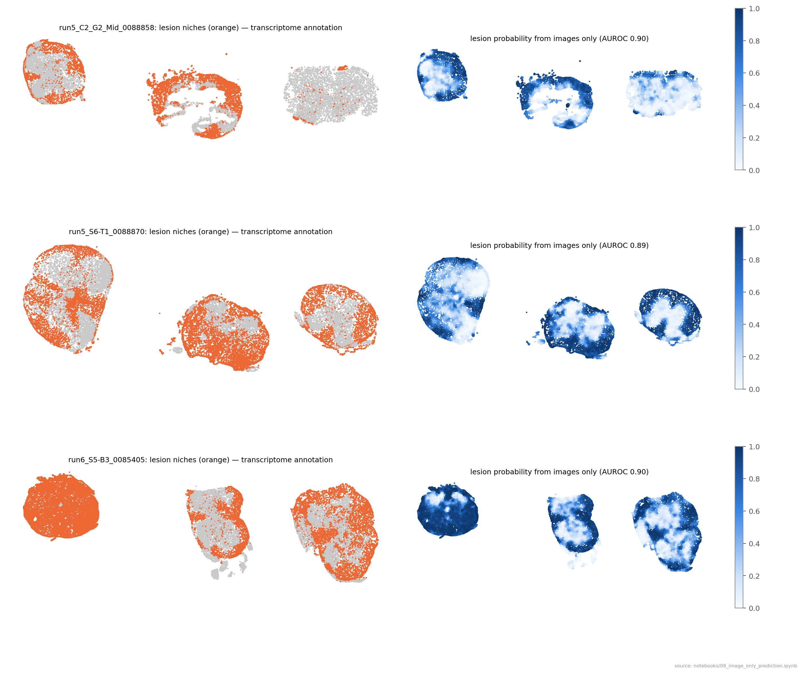
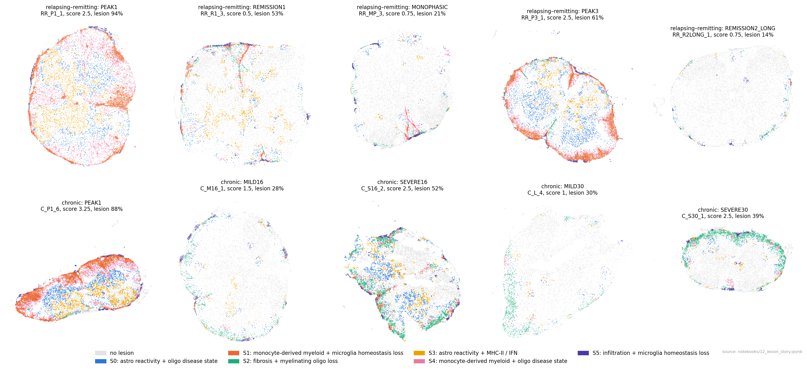
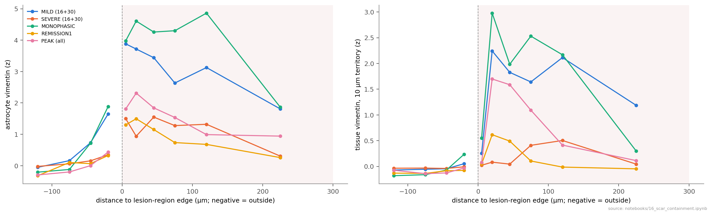
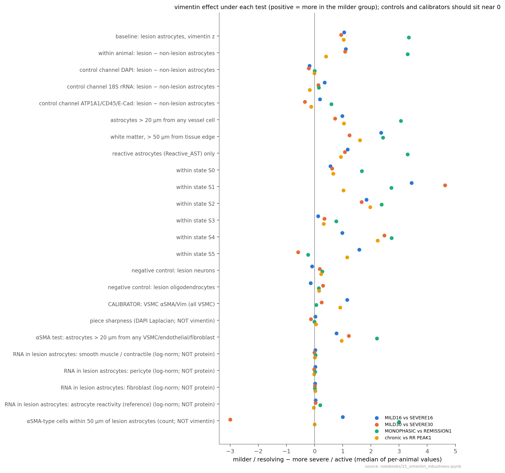
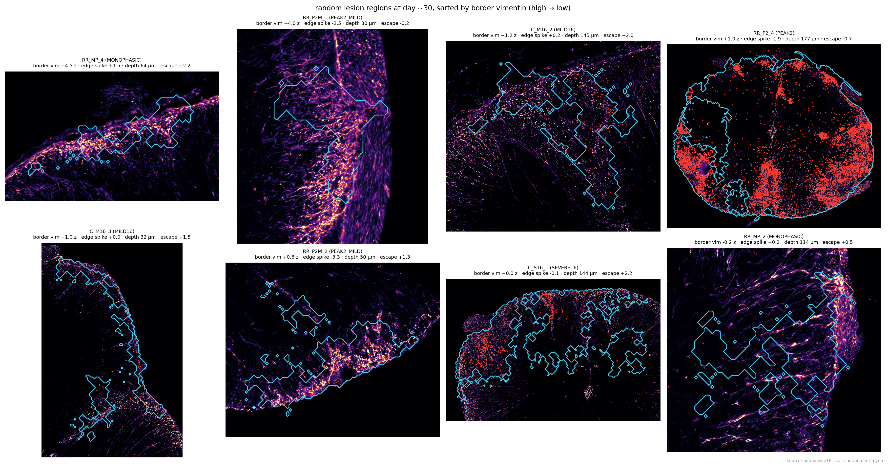
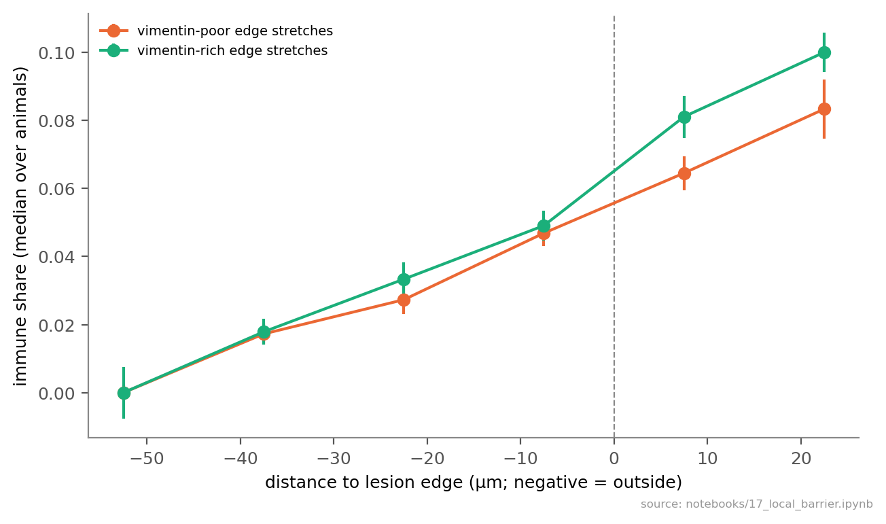

# Beyond Boundaries — Methods and Results

*Xenium multimodal cell-segmentation stains in mouse EAE spinal cord: what they add to the transcriptome, and what
they show about how lesions form, resolve or persist.* Draft, 8 October 2026. Every number below is produced by the
notebooks named in brackets (`notebooks/NN_*.ipynb`); the running log is `RESULTS.md`.

---

## Methods

### 1. Animals, disease models and clinical scoring

Two experimental autoimmune encephalomyelitis (EAE) courses from the RRMAP2 study were analysed (animal work, induction
and scoring were done upstream; descriptions here follow the study metadata).

- **Chronic EAE** (MOG35–55 immunisation; adjuvant controls "MOG CFA", "CFA"; immunised pre-symptomatic animals
  "NONSYMPTOM"). Sacrifice stages: onset (OS1, d10–14, score 0.25–0.5), peak (PEAK1, d13–18, 2.5–3.25), chronic mild
  (MILD16 d27–28, MILD30 d43–50) and chronic severe (SEVERE16 d28–29, SEVERE30 d41). The 16/30 suffix is a cohort label,
  not the sacrifice day.
- **Relapsing–remitting (RR) EAE** (PLP139–151; adjuvant control "PLP CFA"). Stages: ONSET1 (d11–15), ONSET2 (d13),
  PEAK1 (d14–18), REMISSION1 (d20–25), PEAK2_MILD (d31), PEAK2 (d32–33), MONOPHASIC (never relapsed, d32–33), PEAK3
  (d38–49), REMISSION2 (d42–47), REMISSION2_LONG (d48).
- **Clinical scores and weights** were recorded daily from d0 to sacrifice (up to d51;
  `data/clinical/Fixed_RRMap2_FinalSamples_All{Score,Weight}_curated_20260723_212152.xlsx`). Per animal
  (`scripts/clinical_metrics.py`): onset day (first score > 0); first-attack peak (maximum within 10 days of onset) and
  its day; lowest score after the first peak (nadir); area under the score curve (trapezoid over scored days); maximum
  score; relapse seen (rise ≥ 1 after the nadir); maximum weight loss (% of d0). Name harmonisation: the five MILD30
  animals are `C_M30_k` in the score sheet and `C_L_k` in the annotation; k = 1, 4, 5 match uniquely on sacrifice day and
  sex, k = 2, 3 (both d45, male, score 1) were paired by number. RR_MP_3 lacks a sacrifice score in the sheet; the
  annotation's 0.75 was used.

The **statistical unit is the animal** throughout. 67 animals are in the annotated object (chronic 34, RR 33): controls
13, onset 9, peak 19, chronic late 13, recovery 13.

### 2. Xenium data

- **Runs.** Five Xenium 5K runs (mouse 5K panel + 95 custom genes), fresh-frozen spinal cord, 0.2125 µm/px: run 1
  (chronic, XOA 3.2), runs 2–3 (RR, XOA 3.2), runs 5–6 (both arms, XOA 4.0). 54 annotated images (sections); each image
  holds 2–3 tissue pieces from different animals (`meta_sample_id` = piece, `sample_name` = animal; every piece is one
  animal, no piece spans images). In runs 5/6 pieces are ≥ 326 µm apart; in runs 1–3 they often touch (closest cells of
  two pieces 6–30 µm apart in 8 images).
- **Segmentation-kit stains** (Xenium Multimodal Cell Segmentation): ch0 DAPI; ch1 ATP1A1/CD45/E-cadherin (one
  channel); ch2 18S rRNA; ch3 αSMA/vimentin (one channel). Channel identity was verified from OME metadata and image
  content. Xenium segmented ~93–97 % of cells with the interior (18S) stain, 0.5–4 % with the boundary stain and 2–3 % by
  nucleus expansion. *Vim*, *Acta2* and *Atp1a1* are not on the panel.
- **Annotation** (upstream, curated): 1,384,881 cells; cell types at four levels (`Anno_L1_curated`, 19 types;
  `Anno_L2`, 42); curated niche states (`Curated_niche_state`: Physiological, Lesion_active/progressive/mix/reactive,
  Meninges, Vasculature); anatomical regions (`Global_anatomical_region`). Expression: log-normalised `X`, raw counts in
  `layers['counts']`. Contaminating tissue and misassigned cells were removed upstream; analyses use annotated cells only.
- **Data transfer and integrity (runs 1–3).** Images and masks (`morphology_focus/`, `cells.zarr.zip`, `cells.parquet`,
  `cell_feature_matrix.h5`, `experiment.xenium`) were copied from the KI file share; transcripts were not copied (only
  needed for a QC-only autofluorescence mask). Every bundle was checked (`scripts/check_bundle_integrity.py`): CRC of
  every `cells.zarr.zip` entry, full reads of parquet/h5 files, decode of every full-resolution image tile; one file
  corrupted in transit was re-fetched and verified by MD5. All copied files were additionally compared by MD5 with the
  source.

### 3. Per-cell image features (`scripts/01_extract_features.py`, `src/beyondboundaries/features.py`)

For every segmented cell, 201 features were computed from the four full-resolution stain images and the Xenium cell
and nucleus masks, in 2048 × 2048 px windows with a 256 px (54 µm) halo so every cell is measured whole (tiling
invariance tested exactly; 0 truncated cells). Mask areas equal Xenium `cell_area`; centroids agree within 0.28 µm.

- **Compartments**: cell; nucleus; cytoplasm (cell − nucleus); rim (cell pixels within 1 µm of the cell edge); ring
  (non-cell pixels within 2 µm outside the cell, assigned to the nearest cell); territory (non-cell pixels within
  10 µm, nearest cell: the cell's extracellular surroundings, e.g. neuropil).
- **Intensity**: mean, 50th/90th/99th percentile and sum per compartment and channel.
- **Radial profile**: mean intensity in 5 bins from cell centre to edge (by distance to the edge), ÷ the cell mean.
- **Polarity**: offset of the intensity-weighted centroid (intensity above the cell's 10th percentile) from the
  geometric centroid and from the nucleus centroid, ÷ equivalent radius; plus the x/y offset in µm (direction).
- **Texture**: Haralick features (contrast, homogeneity, angular second moment, entropy, correlation) from a symmetric
  grey-level co-occurrence matrix over 4 directions at 0.5 µm, 16 levels (per-cell 1–99 % rescaling), on the nucleus for
  DAPI and the whole cell for the other channels.
- **Morphology**: cell and nucleus area, perimeter, eccentricity, solidity, axes, orientation, circularity,
  nucleus:cell area ratio, nucleus offset.

### 4. Background and normalisation (`src/beyondboundaries/background.py`, notebook 02, `scripts/02_normalise_all_runs.py`)

- **Low-resolution maps** (pyramid level 3, 1.7 µm/px) per image: tissue mask (smoothed log(DAPI + 18S) above Otsu,
  holes filled, objects < 2 × 10⁴ µm² removed); cell-free tissue (tissue > 5 µm from any cell); local background per
  channel = Gaussian-weighted (σ 25 µm) mean of cell-free pixels (normalised convolution); distance to the tissue edge.
  An autofluorescence proxy (cell-free and transcript-poor) was used for QC only (runs 5/6).
- **Normalisation** of intensity features: x_norm = (x − local background) / s, with s = 90th percentile of the raw cell
  mean of physiological-niche cells in the same image (the staining/imaging unit). Ratio-type features (radial,
  polarity, texture, morphology) are unchanged. Per-piece scaling was rejected because piece-level intensity tracks
  disease (notebook 02). The all-runs table reproduces the runs 5/6 table exactly (max difference 0 over 500,379 cells).
- **Robust within-image z** (used for all cross-animal image readouts): z = (x − median) / (1.4826 × MAD) over all cells
  of that image (or of that cell type), so animals are compared only against cells stained and imaged with them.

### 5. What the stains add to the transcriptome (notebooks 03–09)

- **Expectation tests** (03): AUROC between expected-high and expected-low cell groups for six known stain patterns
  (VSMC αSMA; leukocyte vimentin; neuron/oligodendrocyte low ch3; ependymal vimentin; neuronal 18S; leukocyte CD45 at the
  rim), overall, per segmentation method and per animal.
- **Orthogonality** (04): per cell type (14 types with ≥ 500 cells and ≥ 5 animals; ≤ 30,000 cells per type; 18S-
  segmented), 118 image features (rank-inverse-normal transformed within type) predicted by ridge regression
  (`RidgeCV`, α = 10⁻²…10⁴, per target) from technical covariates (image, spinal level, log transcripts, log area, log
  distance to tissue edge) with or without 50 transcriptome principal components (fitted inside each fold on
  log-normalised counts); 5-fold cross-validation grouped by animal; pooled out-of-fold R². The reverse direction
  (images → transcriptome PCs), lesion tests on residuals (per-animal shifts, BH-corrected) and Leiden clustering of
  residuals (resolution 0.3) followed.
- **Field vs cell** (05): each cell's residual vs the mean residual of its 30 nearest cells of *other* types (shared
  local field); field vs lesion distance and local background. **Animal level**: leave-one-animal-out ridge
  (α = 10⁻¹…10⁵) predicting clinical score from per-animal transcriptome or image summaries (lumbar), permutation p
  (score labels shuffled).
- **Targeted readouts** (06–07): (i) astrocyte protein score (within-image z of αSMA/Vim cell mean + cytoplasm p90 −
  ATP1A1 rim) vs an RNA reactivity score (mean gene-wise z of *C3, Gfap, Serpina3n, Cd44, Osmr, Timp1, Socs3, Serping1,
  H2-D1, Psmb8, Gbp2* minus *Slc1a3, Kcnj10, Slc6a11, Fgfr3, Gjb6, Aldoc, Aldh1l1*); quadrants of the top/bottom
  quartiles; (ii) polarity direction: cosine between a cell's 18S polarity vector and the direction to the nearest
  endothelial/VSMC cell (≤ 15 µm); (iii) 18S per cell type, lesion vs physiological, with and without adjusting for
  transcript density; (iv) **neuropil index** = raw ATP1A1 territory intensity ÷ the median of the same tissue piece and
  region class (WM or GM); lesion vs physiological paired within piece (Wilcoxon over pieces).
- **Image-only prediction** (08–09): gradient-boosted trees (`HistGradientBoostingClassifier`, 300 iterations,
  learning rate 0.1, early stopping, balanced class weights) on image features only (cell features + means over the 15
  and 50 nearest cells of 17 key features); 5-fold CV grouped by animal with balanced subsampling (≤ 3,000–8,000 cells
  per class). Targets: L1 type (14), L2 subtypes, anatomical region (10), lesion state, lesion vs physiological; per
  animal: clinical score and metadata. **Transfer**: train on one run, test on another (09); leave one run out over all
  five runs (13).

### 6. Control-referenced lesions and lesion states (notebook 10)

- **Neighbourhood vector** for every cell: its 30 nearest cells in the same tissue piece (including itself) described
  by (i) composition over 23 cell types/states (L2 where it carries disease state: microglia, monocyte-derived
  macrophages (MDM), border-associated macrophages, DC, NK/DC, T, B, neutrophils, homeostatic and reactive astrocytes,
  MOL, NFOL, disease-associated oligodendrocytes (DAO), OPC/COP, excitatory/inhibitory/cholinergic neurons, endothelium,
  VSMC, EAE-associated and other fibroblasts, Schwann, ependymal), (ii) the neighbourhood mean of seven gene programs
  (per-cell score = mean gene-wise z of log-normalised expression): lipid-associated myeloid (*Trem2, Lpl, Cd36, Gpnmb,
  Igf1, Itgax, Cst7, Cd9, Plin2, Abca1, Ch25h, Msr1*), MHC-II (*H2-Aa, H2-Ab1, H2-Eb1, Cd74*), interferon (*Ifit1, Ifit3,
  Isg15, Irf7, Stat1, Oasl2*), astrocyte reactivity (*C3, Gfap, Serpina3n, Cd44, Osmr, Timp1, Socs3, Serping1*),
  homeostatic microglia (*P2ry12, Tmem119, Sall1, Cx3cr1, Siglech*), myelin (*Mbp, Mog, Mag, Cldn11, Mal, Opalin*),
  ECM/fibrosis (*Col1a1, Col1a2, Fn1, Tnc, Postn*), and (iii) log cellularity (cells per 1000 µm² within the 30-cell
  radius).
- **Reference and abnormality.** Per region class (WM: WM + WM_Meningeal; GM: GM + dorsal + ventral horn; meninges),
  features were standardised by the control neighbourhoods (mean, SD floored at 0.02) and the squared Mahalanobis
  distance to the control cloud computed (Ledoit–Wolf covariance, ≤ 60,000 control cells). **Calibration**: each control
  animal was scored against the other controls; the lesion threshold is the 99th percentile of these held-out distances,
  so a new control animal is ~1 % lesion by construction. Cells in DRG, vasculature, central canal or unassigned regions
  were not scored.
- **Lesion states.** Ten interpretable axes, each a mean z against control neighbourhoods of the same region:
  infiltration (T, B, NK/DC, neutrophils), monocyte-derived myeloid (MDM, DC), lipid-associated myeloid program,
  MHC-II/IFN, astrocyte reactivity (program + reactive astrocyte share), oligodendrocyte disease state (DAO),
  myelinating-oligodendrocyte loss (MOL share and myelin program, sign flipped), microglia homeostasis loss (sign
  flipped), fibrosis (EAE fibroblasts + ECM program), cellularity. Lesion neighbourhoods were clustered by k-means
  (k = 6, 10 initialisations, fitted on ≤ 400,000 cells, arcsinh-transformed axes). States are named by the two axes
  that most distinguish them from the other states (profile z-scored across states).

### 7. Disease-course analyses (notebook 11)

Per animal: share of WM/GM/meningeal cells in each lesion state; composition (share of all cells per type; MOL per WM
cell; neurons per GM cell); mean lesion axes in lesion tissue; image readouts (18S-segmented cells; cells < 20 µm from
another tissue piece excluded): neuropil index (vs the piece's own non-lesion WM/GM), tissue vimentin (territory) and
astrocyte vimentin (cell mean) as within-image z, myeloid 18S texture (GLCM correlation, within-image z); medians in
lesion and non-lesion tissue (≥ 50 cells). Contrasts by Mann–Whitney U (descriptive), associations by Spearman ρ.
**B-cell aggregates**: B cells with ≥ 5 B cells among their 15 nearest cells (same piece). **Damage memory**: per animal
× lesion state readouts, peak vs recovery groups (≥ 3 animals each), Benjamini–Hochberg across tests.

### 8. Replication on runs 1–3 (notebook 13)

The same code on runs 5/6 (reproducing earlier numbers) and separately on runs 1–3: 18S texture vs score (per animal ×
section, lumbar, ≥ 30 cells per type, within-section centring; DAPI texture as control); WM neuropil loss (paired within
piece, both lesion definitions; both neuropil references compared); astrocyte protein vs RNA (06 definitions); T-cell
polarity towards vessels; leave-one-run-out image models.

### 9. Relapse lesion origin (notebook 14)

Lesion states grouped as active (S1, S4), old/late (S2), glial (S0) and other. Per animal: share of active cells with an
old cell within 50 µm in the same piece, against a within-piece permutation null (state labels shuffled among the
piece's lesion cells, 30 permutations; enrichment = observed ÷ expected); distance from active to nearest old cell;
lesion objects (lesion cells linked when < 30 µm apart in a piece, ≥ 50 cells) and the share of active tissue in objects
containing ≥ 10 % old tissue; location of active tissue; B-cell aggregates near old tissue; astrocyte vimentin at the
active/old interface. First attack (RR and chronic PEAK1, 10 animals) vs relapse (PEAK2, PEAK2_MILD, PEAK3, 9 animals).

### 10. Vimentin: robustness, lesion edge, αSMA (notebook 15)

Effect = median per-animal value in the milder/resolving group minus the more severe/active group, for four contrasts
(MILD16 vs SEVERE16; MILD30 vs SEVERE30; MONOPHASIC vs REMISSION1; chronic vs RR PEAK1). Tests: within-animal contrast
(lesion − non-lesion astrocytes of the same animal); same contrast in DAPI, 18S and ATP1A1; astrocytes > 20 µm from
endothelial/VSMC cells; astrocytes with no VSMC, endothelial or fibroblast cell within 20 µm; WM > 50 µm from the tissue
edge; reactive astrocytes only; within each lesion state; lesion neurons and oligodendrocytes (negative controls); VSMC
αSMA/Vim (calibrator); raw intensities within the four images that hold both MILD16 and SEVERE16 animals; piece
sharpness (variance of the Laplacian of DAPI at 0.43 µm/px); smooth-muscle/contractile (*Myh11, Tagln, Cnn1, Des, Mylk,
Smtn*), pericyte (*Pdgfrb, Kcnj8*) and fibroblast (*Postn, Col1a1*) transcripts in lesion astrocytes; per run.
A first edge profile used a cell-based signed distance (inside: distance to the nearest non-lesion cell; outside: minus
the distance to the nearest lesion cell). It is superseded by the region-based profile (section 11), because with a
cell-based distance "just inside the edge" mostly means isolated lesion cells in healthy tissue.

### 11. Lesion regions, vimentin location and containment (notebook 16)

**Lesion regions** (used for all lesion-level results): per tissue piece on a 10 µm grid, the share of control-referenced
lesion cells among the cells of each grid square, smoothed (Gaussian σ = 15 µm, density-weighted), thresholded at 0.5
within tissue, holes filled; connected regions ≥ 0.005 mm² with ≥ 100 cells and ≥ 30 cells within 50 µm outside (356
regions in 53 animals; median 96 % lesion cells inside). Each cell gets a signed distance to the nearest region edge
(distance transform; + inside, − outside), and cells ≤ 50 µm outside are assigned to the nearest region. **Depth from
the cord surface**: the piece's tissue (grid squares with cells, closed by 30 µm, holes filled), largest connected
component = cord (drops detached roots and meninges), distance to its outline. Per region: border tissue and astrocyte
vimentin (−30…+30 µm), edge spike (tissue vimentin 0–10 µm inside minus the mean of −30…−10 µm and +20…+45 µm), active
share (S1 + S4), infiltrating immune share (T, B, NK/DC, DC, MDM, neutrophils; not microglia) 0–50 µm outside, and
**escape** = log₂(that share ÷ the animal's immune share > 150 µm from any region). **Vimentin location**: profiles of
astrocyte and territory vimentin against the region-edge distance (bins −150…+300 µm, median of per-animal medians, ≥ 15
cells per bin); per animal, astrocyte vimentin inside regions minus outside (> 60 µm away). **Containment test**: for
animals with ≥ 5 regions, Spearman ρ between border vimentin and escape across their regions after regressing out log
size, active share and log depth; Wilcoxon signed-rank of per-animal ρ against 0; deep regions (> 100 µm) separately.
A first version used cell-linkage objects (lesion cells < 30 µm apart); many were diffuse scatters without a real
outline and its tissue-mask depth was wrong next to roots and meninges, so its results are withdrawn.

### 12. Local barrier tests (notebook 17)

**Border segments**: the ±30 µm edge band of each lesion region cut into 100 µm × 100 µm segments with ≥ 5 cells just
inside (0–30 µm) and just outside (0–30 µm); regions with ≥ 3 segments (3,188 segments, 392 regions, 53 animals). Per
segment: astrocyte vimentin (primary; cell-intrinsic) and territory vimentin (secondary; also includes leukocyte
vimentin), immune share inside, 0–30 µm and 30–60 µm outside, active share inside, log depth. Variables centred within
each region (region fixed effect); per animal, partial Spearman ρ between vimentin and outside immune share adjusting
for inside immune share, active share and depth (≥ 6 segments); Wilcoxon of per-animal ρ; bootstrap 95 % CI of the
median (animals resampled, 5000×). **Old lesions at relapse** (PEAK2, PEAK2_MILD, PEAK3): 100 µm patches with ≥ 10 old
(S2) cells; vimentin of the old tissue (S2 astrocytes; S2 territory) vs the active (S1/S4) share among cells within
60 µm, centred within region, per-animal partial ρ adjusting for log depth and log old-cell count.

### 13. Strength of the vimentin–outcome association (notebook 18)

35 post-peak animals with ≥ 30 lesion astrocytes. Measure: median astrocyte vimentin (within-image z) inside lesion
regions minus the same animal's astrocytes > 60 µm outside. Partial Spearman ρ with the clinical score at sacrifice
(residuals after linear adjustment for days since the first peak, first-attack height, arm, run (one-hot), lesion share,
or RNA astrocyte reactivity (reactive − homeostatic gene z, lesion astrocytes)); leave-one-run-out; within lesion states
(≥ 20 astrocytes of that state); within-image pairs (all pairs of post-peak animals sharing a Xenium image with different
scores; sign test over animal pairs).

### 14. Software and statistics

Python 3.12.14; numpy 2.2.6, pandas 2.2.3, scipy 1.15.2, scikit-learn 1.7.2, anndata 0.12.19, scanpy 1.11.5,
scikit-image 0.25.2, tifffile 2025.10.16, zarr 2.18.7, matplotlib 3.10.9 (`environment.yml`). Notebooks are paired
jupytext scripts (`notebooks/py/`). Tests are two-sided; with 2–19 animals per group, p values are descriptive and the
evidence for a finding is its consistency across independent contrasts. Benjamini–Hochberg where a family of tests
was screened. Small-group contrasts are reported with every animal shown.

---

## Results

### A. What the segmentation stains add to the transcriptome

**The stains measure what they claim, except CD45.** Known patterns appear in every animal: ependymal vimentin (AUROC
0.86), neuronal 18S (0.78), neuron/oligodendrocyte low ch3 (0.74), leukocyte vimentin (0.73), VSMC αSMA (0.66), also in
boundary-segmented cells. Leukocytes are not brighter at the rim in the boundary channel (0.48), even where neuropil is
dimmest: in mouse spinal cord that channel reports ATP1A1 only [03].

**Most of each image feature is not explained by the transcriptome, but most of that is optics.** Covariates plus
transcriptome explain a median 11–18 % of image-feature variance per cell type (transcriptome-unique 6–10 %; best
morphology, nucleus:cell ratio ΔR² 0.40–0.47). The remainder is spatially coherent but largely a local field shared
by all cell types (r ≈ 0.38 for rim/cytoplasm/nuclear intensity) that follows local background, not lesions; the
cell-specific remainder shifts with lesion state in 19/924 tests (~0.1 SD); residual clustering finds no discrete
hidden states [04–05].

**Images alone recognise cells and map lesions, on unseen runs.** Without transcripts, held-out animals: cell type 46 %
balanced accuracy (14 types, chance 7 %; ependymal 0.86, neuron 0.81, immune cells poor without CD45), subtypes
(microglia 72 %, reactive astrocytes 68 %), anatomy 63 % (images add to the transcriptome, 0.68 → 0.73), lesion maps
AUROC 0.90. Models trained on other runs work on every held-out run (lesion AUROC 0.85–0.91, cell type 0.42–0.47),
across five runs, three batches and two analysis-software versions, even though images identify their run with 100 %
accuracy [08, 09, 13].

**Biology only the images show** (replicated in runs 1–3 unless stated) [06, 07, 13]:
- *White-matter neuropil loss*: lesion WM has less surrounding ATP1A1 than physiological WM of the same piece (×0.79 in
  runs 5/6, ×0.72 in runs 1–3, 58 pieces, p < 10⁻⁴); grey matter ~unchanged.
- *Astrocyte reactive RNA precedes vimentin protein*: protein vs RNA ρ 0.46–0.58 per run; "RNA-only" astrocytes are
  more common in active disease than in recovery (runs 1–3 0.076 vs 0.046, p = 0.01; runs 5/6 0.111 vs 0.071, p = 0.02).
- *Perivascular T cells orient their 18S-rich cytoplasm towards the vessel* (cos 0.14 runs 5/6; 0.19 runs 1–3,
  33 animals, p < 10⁻⁴); also fibroblasts, macrophages, microglia; not neurons.
- *18S rises beyond RNA content in activated lesion cells* (Schwann +0.8, endothelium +0.4 SD).
- *18S texture vs severity* replicates only in astrocytes, myeloid cells and oligodendrocytes (within-section ρ 0.54–0.76),
  not endothelium, fibroblasts or neurons; downgraded from candidate biomarker.

*Lesion maps from images alone (held-out animals) next to the transcriptome-defined lesion niches.*

### B. Lesions redefined against control tissue

The curated niche labels call 4–20 % of never-immunised control tissue "lesion" (almost all "Lesion_mix"). With the
control-referenced definition, controls are 0.3–2.4 % lesion (MOG-CFA and PLP-CFA alike), and 72 % of cells labelled
Lesion_mix look like control tissue. Lesions do resolve: median lesion share RR PEAK1 0.93 → REMISSION1 0.53 →
MONOPHASIC 0.35 → REMISSION2 0.30 → REMISSION2_LONG 0.14; chronic PEAK1 0.87, SEVERE16 0.52, MILD16 0.28 [10].

**Six lesion states** [10]: S1 monocyte-derived myeloid (active; ~35 % of tissue at PEAK1/PEAK2, ~0 in long
remission); S4 monocyte-derived + oligodendrocyte damage (peak); S2 fibrosis + myelinating-oligodendrocyte loss (late:
SEVERE30 20 %, MILD30 13 %, REMISSION2 12 %); S0 astrocyte reactivity + DAO (persists after peak); S3 astrocyte
reactivity + MHC-II; S5 lymphocytic infiltration. The course runs from active infiltrate to fibrotic, demyelinated and
glial-reactive tissue.

*Lesion states in one representative animal per stage (median lesion share of its stage, largest piece).*

### C. Lesion vimentin and outcome

Astrocyte αSMA/vimentin inside lesions (within-image z) is higher in the milder or resolving group in every contrast:
MILD16 vs SEVERE16 2.3 vs 0.7 (same images), MILD30 vs SEVERE30 4.4 vs 2.0, MONOPHASIC vs REMISSION1 3.3 vs 1.1,
chronic vs RR PEAK1 2.6 vs 0.2 (p = 0.04), and within the glial state from peak to recovery 0.16 → 1.14. Among the 13
chronic-late animals it correlates with the clinical score (ρ = −0.80), partly a run artefact (MILD30 is run 1 only) [11, 12].

**Strength of the link with outcome** [18]. Across 35 post-peak animals, lesion vimentin (inside − outside) vs
clinical score: ρ −0.34 (p = 0.046), −0.44 adjusted for days since the first peak (p = 0.008); stable when each run is
left out (−0.42 to −0.55), within lesion states (S0 −0.49, S2 −0.56, S1 −0.45, S4 −0.41), and beyond RNA astrocyte
reactivity (vimentin | RNA reactivity ρ −0.63, p < 0.001; RNA reactivity itself +0.29). Adjusting for lesion share
(−0.26, n.s.) or first-attack height (−0.29, p = 0.09) weakens it, and in pairs of animals imaged together the worse
animal has less vimentin in 12 of 19 pairs (p = 0.36). The apparent non-replication in runs 1–3 reflects no score
variance there (MILD30 all 1.0; RR runs 1–3 ρ −0.46). Part of the association is channel-wide: VSMC αSMA/Vim signal per
animal also falls with score (ρ −0.36, p = 0.04) and tracks astrocyte vimentin (ρ +0.56); adjusted for it, the
astrocyte-specific association is ρ −0.32 (p = 0.06; astrocyte − VSMC ρ −0.36, p = 0.03). Overall: weak-to-moderate
support, entangled with disease burden and partly shared across the channel; separate antibodies needed.

**Not technical, not αSMA** [15]. The effect keeps its direction in all four contrasts within animals (lesion −
non-lesion astrocytes: +1.10, +1.09, +3.31, +0.40), far from vessels, with no VSMC, endothelial or fibroblast cell
within 20 µm (+0.78, +1.21, +2.22, +0.96), in deep white matter, in reactive astrocytes only and within lesion states.
Controls stay near zero: DAPI (−0.21…0.00), lesion neurons and oligodendrocytes, piece sharpness, and smooth-muscle,
pericyte and fibroblast transcripts in the lesion astrocytes (no sign of αSMA-cell contamination). The VSMC
calibrator is also higher in the milder group for MILD16 vs SEVERE16 (+1.16) and chronic vs RR (+0.91), so part of
those two raw differences may be channel brightness; the within-animal contrast removes it, leaving chronic vs RR as
the weakest contrast (+0.40). MILD30/SEVERE30 and MONOPHASIC/REMISSION1 have flat calibrators.

**Vimentin fills lesions; there is no ring** [16]. Against distance to the edge of lesion regions, vimentin rises on
entering a lesion and stays high through the interior, with no edge peak. Astrocyte vimentin inside lesion regions minus
the same animal's tissue outside: PEAK1 0.60; MILD16 2.27 vs SEVERE16 1.01; MILD30 3.30 vs SEVERE30 2.07; MONOPHASIC
4.28 vs REMISSION1 1.26. Vimentin marks a lesion-wide astrocyte response that is low at peak and strongest in animals
that recover. (A first, cell-based edge profile [15] showed an apparent ring; it was an artefact and is withdrawn.)

*Vimentin against distance to the edge of lesion regions (negative = outside), median over animals per group.*

*The vimentin effect under each technical test; controls and calibrators should sit near zero.*

### D. Does a vimentin scar contain lesions?

A collaborator's hypothesis was that a successful astrocyte scar restricts immune infiltration. With lesion regions, lesions
with more border vimentin have **neither fewer nor more** infiltrating immune cells around them than other lesions of the
same animal (median ρ 0.00, p = 0.65, 36 animals; deep regions ρ −0.39, n.s., 10 animals). Border vimentin does not
clearly rise from the chronic peak to MILD16 (0.67 → 0.50) and is lowest in SEVERE16 (0.02). Where vimentin is bright it
fills the lesion rather than lining it, so the data neither support nor refute containment [16]. A first version with
cell-linkage objects suggested more immune cells around better-bordered lesions and a border built by day 30; both were
artefacts of diffuse objects and are withdrawn.

*Eight random lesion regions from day ~30 animals: αSMA/vimentin (magma), region outline (cyan), infiltrating immune
cells (red).*

**Sharper within-lesion tests find no barrier** [17]. Lesion edges cut into 100 µm stretches (3,188 stretches, 392
lesions, 53 animals) and compared within the same lesion: astrocyte vimentin of a stretch vs immune cells just outside,
adjusted for the immune load inside, activity and depth, gives median per-animal ρ +0.035 (95 % CI −0.016 to +0.073; a
barrier would give ρ < 0). Vimentin-rich stretches have more immune cells inside the edge and the same outside. In
relapse animals, vimentin-rich old fibrotic tissue has as much new active tissue next to it as vimentin-poor old tissue
of the same lesion (ρ −0.02, p = 0.36). **At this resolution vimentin is a marker of the resolution phase, not a
measurable barrier to infiltrating immune cells.**

*Immune share across the lesion edge for vimentin-rich vs vimentin-poor stretches of the same lesions.*

### E. Chronic severity: lesions that stayed active

Severity is set at the first attack: all SEVERE animals peaked at 3.5 and never fell below 2.25; MILD peaked 1.5–2.5
and partly recovered. At d27–41 severe animals still carry more lesion (0.52 vs 0.28; 0.42 vs 0.30), more active
states (S1, S4), T cells and cellularity, and fewer myelinating oligodendrocytes in WM (0.08 vs 0.15 per WM cell);
neuropil is not lost more. Across 13 chronic-late animals the score correlates with low lesion vimentin (ρ −0.80; partly
run-confounded),
lesion share (0.58), T cells (0.47) and cellularity (0.38) (run 5 alone: inflammation 0.77–0.89). The tissue-loss
hypothesis is not supported [11, 12].

### F. Relapse

**Not predictable clinically**: monophasic first peaks 2.25–2.75 vs relapsers 2.5–3.0, similar onset, weight loss and
early nadir. **B cells**: RR animals accumulate B cells after the first attack (per 1000 cells: PEAK1 14 → REMISSION1
22 → PEAK2_MILD 25 / PEAK3 19), increasingly in aggregates (0.26 → 0.55) and in the meninges (0.16 → 0.58–0.90).
Never-relapsing animals have fewer than REMISSION1 animals (9 vs 22, p = 0.03), recovered further after the first
attack (nadir 0.25 vs 0.75, p = 0.03) and carry more lesion vimentin. The chronic arm has ≤ 8 B cells per 1000
throughout [11, 12].

**New lesions, with flaring at old borders** [14]. At relapse, active tissue touches old fibrotic tissue far more than
at the first attack (active cells within 50 µm of old tissue 0.23 vs 0.05, p = 4 × 10⁻⁴; median distance 101 vs 265 µm),
but active and old tissue still form separate patches (enrichment vs permutation 0.33 vs 0.14, both < 1). Relapse
animals have more lesion objects (17 vs 8, p = 0.01) and only 19 % of active relapse tissue is in objects containing old
tissue (0 % at the first attack). B-cell aggregates at relapse sit near old tissue (0.72 vs 0.31) and in the meninges
(0.33 vs 0.05). No vimentin signature at the active/old interface. Caveat: S2 also forms a thin pial rim at the first
attack (1.7 % of lesion tissue).

### G. Chronic vs RR at the same peak

Both PEAK1 (d13–18, score ~3): RR lesions are more monocyte-derived with oligodendrocyte damage (S4 0.26 vs 0.17,
p = 0.01) and less lipid-laden (5.4 vs 9.1, p = 0.01); RR animals have more B cells (14 vs 3 per 1000) and more weight
loss (22 vs 14 %); chronic lesions show more astrocyte vimentin. Arms differ in antigen, likely strain and run, so these
are descriptive [11].

### H. Damage memory

Within the same lesion state, from peak (19 animals) to recovery (13), neuropil trends back towards normal (S1 0.79 →
1.03; S5 0.88 → 0.99, p = 0.02) while vimentin rises (glial S0/S3 tissue vimentin p = 0.009/0.005; best q = 0.13).
Lesions that persist into recovery look repaired in neuropil but scarred in vimentin [11]. (This readout pools WM and
GM; WM lesions alone stay below 1 [13].)

---

## Limitations

- Small groups (2–19 animals) and a cross-sectional design: temporal statements ("precedes", "builds", "resolves")
  are inferred from animals sacrificed at different times.
- The two arms differ in antigen, likely mouse strain, and Xenium run; MILD30 is run 1 only; MONOPHASIC and REMISSION1
  never share an image (handled with within-image z, within-animal contrasts and normalised displays).
- Lesion calls and states are transcriptome-defined; image readouts are independent measurements on top.
- αSMA and vimentin share one channel (tests in [15] find no αSMA contribution in astrocytes, but a validation stain
  with separate antibodies would settle it); CD45 is undetectable; 18S drew ~95 % of the masks, so 18S distribution
  features are partly by construction.
- In runs 1–3 tissue pieces touch; cells < 20 µm from another piece are excluded from image readouts, and spatial
  computations are done within pieces.
